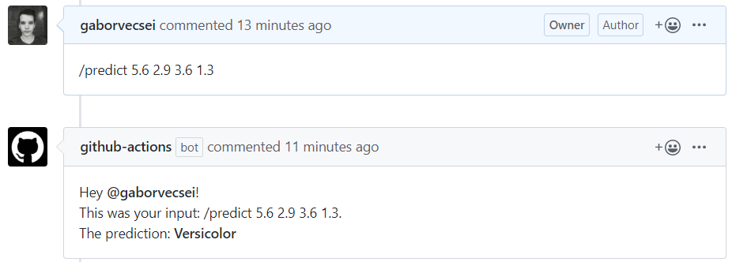
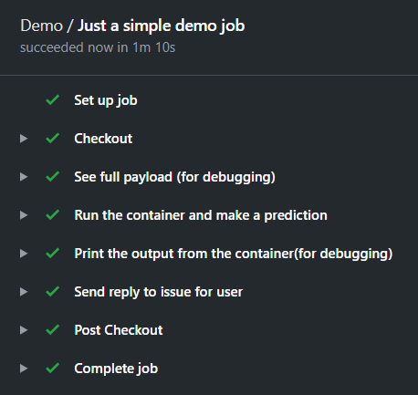

# Machine Learning Inference with GitHub Actions

This repository demonstrated how you can use *Github Actions* to perform inference with your ML models. In this
example scenario a [Random Forest classifier](https://scikit-learn.org/stable/modules/generated/sklearn.ensemble.RandomForestClassifier.html)
is used to make predictions trained on the [Iris dataset](https://en.wikipedia.org/wiki/Iris_flower_data_set).

The GitHub Actions workflow is triggered when an issue receives a comment. If the comment contains the `/predict`
prefix, then the `main.py` python file starts to parse the comment, make a prediction and construct the reply to the
original comment with the prediction.

Example (and also valid) comment: `/predict <sepal_length> <sepal_width> <petal_length> <petal_width>`
(e.g. `/predict 5.6 2.9 3.6 1.3`)

## Try it out :sunglasses:

Just go to an issue at this repository and then leave a comment with the `/predict` prefic and then 4 numbers separated
by spaces. Just like the example above.

>  /predict 5.6 2.9 3.6 1.3

## Files

- `action.yml`: Describes the action which build a Docker image and performs the comment parsing and inference
- `.github/workflows/main.yaml`: contains the steps which are performed when a comment is received under an issue
- `Dockerfile`: This is the image which will be built and used for the main action
- `issue_comment.sh`: With this script you can send a comment with the GitHub Rest API
- `main.py`: parses the content of the comment, loads model, makes prediction and constructs the reply message
- `random_forest_model.pkl`: Serialized trained sklearn model which will be used for inference (btw. this file should
not be here, as model artifacts should be stored in a storage, but this is just a sample so... :smile:)

## About

Gábor Vecsei

- [Website & Blog](https://gaborvecsei.com)
- [LinkedIn](https://www.linkedin.com/in/gaborvecsei)
- [Twitter](https://twitter.com/GAwesomeBE)
- [Github](https://github.com/gaborvecsei)
